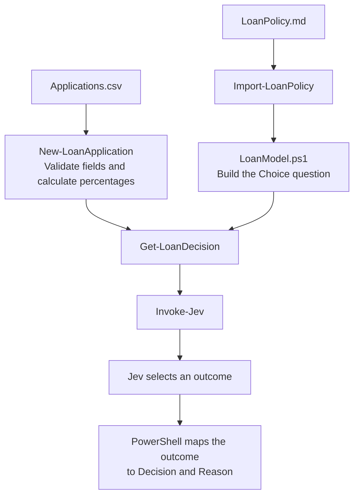

# Loan decisions with ordinary PowerShell objects

**Application -> PowerShell calculates percentages -> Jev applies the policy -> Decision and Reason.**

`New-LoanApplication` creates ordinary PowerShell objects from Income,
Requested, CreditScore, and Debt, validating their ranges when called.
It also calculates `RequestedPercentIncome` and `DebtPercentIncome` using
decimal arithmetic without deliberate rounding. For Income 80000, Requested
30000, and Debt 5000, those percentages are 37.5 and 43.75.

`LoanPolicy.md` contains the instructions and choices in readable text.
`Import-LoanPolicy.ps1` reads that document. `LoanModel.ps1` connects it to
one Choice question and defines the provider and decision/reason mappings.
`Get-LoanDecision.ps1` validates the current fields and refreshes the percentages
before sending the application to Jev, so editing an amount cannot leave stale
calculations in the request. It maps the selected outcome
to a readable decision and reason. `Demo.ps1` changes one field, then reads
the applications from `Applications.csv`, creates each object through
`New-LoanApplication`, and pipes them through the policy. It returns the final results as
PowerShell objects so you can capture, filter, or export them.

Requires PowerShell 7, the installed Jev module, and `TYPESAFE_API_KEY`.

## Follow the flow

PowerShell validates and calculates. The Markdown document defines policy.



`Demo.ps1` connects the CSV input to this flow. `Get-LoanDecision` loads the
policy once per pipeline invocation, then refreshes the calculated percentages
and makes one Jev request per application.

## Trace one application

This row in `Applications.csv` exercises the debt rule:

```csv
Income,Requested,CreditScore,Debt
80000,30000,710,5000
```

`New-LoanApplication` calculates these facts before the request:

| Fact | Value |
| --- | --- |
| CreditScore | 710 |
| RequestedPercentIncome | 37.5 |
| DebtPercentIncome | 43.75 |

The requested percentage is below 50, so the first rule does not apply.
The credit score is at least 680, so the second rule does not apply either.
The debt percentage exceeds 40, so the policy calls for **Debt too high**.
Jev selected that outcome in the verified run, and PowerShell mapped it to:

```text
Decision Reason
-------- ------
Deny     DTI over 0.4
```

## Try a small experiment

In that CSV row, change only Debt from `5000` to `2000`. Predict the outcome
before running `Demo.ps1` again. The calculated debt percentage becomes exactly
40, which the policy allows; the expected outcome is **Approve**.

Restore the row, then change only CreditScore from `710` to `640`. The expected
outcome is **Refer**, even though the debt percentage is still 43.75, because
the credit rule comes before the debt rule. Restore the sample values when done.

## Edit the policy

Open `LoanPolicy.md` in a text editor. Change the rules under **Instructions**
and the descriptions beneath each choice under **Choices**. No PowerShell
syntax is needed. Keep the two section headings and the four choice names:
**Amount too high**, **Credit review**, **Debt too high**, and **Approve**.
Their names connect to the output mappings in `LoanModel.ps1`; changing those
names or adding choices also requires updating that mapping.

Each choice needs a description, which can span multiple lines. The loader
rejects missing sections, empty descriptions, and duplicate names. The policy
is loaded again on each invocation of `Get-LoanDecision`.

## Run

```powershell
$results = @(./Examples/Demos/Loan-Approval/Demo.ps1)
$results | Format-Table
```

For interactive use:

```powershell
. ./Examples/Demos/Loan-Approval/New-LoanApplication.ps1
. ./Examples/Demos/Loan-Approval/Get-LoanDecision.ps1

$state = New-LoanApplication -Income 80000 -Requested 20000 -CreditScore 710 -Debt 5000

$state | Get-LoanDecision
$state.CreditScore = 640
$state | Get-LoanDecision
```

The policy expects `Approve` followed by `Refer`. The factory rejects values
such as `-CreditScore 9000` before creating the object. However,
later property assignments are not range-validated: `$state.CreditScore = 9000`
would succeed locally, but `Get-LoanDecision` rejects it before sending a request.

PowerShell performs the arithmetic. Jev still compares the calculated facts
to the policy thresholds and selects the first matching rule; PowerShell does
not override that selection. A returned reason describes the
selected outcome and is not proof that the numeric condition was satisfied.

The live tests preserve the original policy expectations, including boundary
cases that previously failed. They make 19 API requests:

```powershell
Import-Module Pester -RequiredVersion 5.4.0
Invoke-Pester ./Examples/Demos/Loan-Approval/Get-LoanDecision.Tests.ps1 -Output Detailed
```

Run the factory and policy loader tests without API requests:

```powershell
Invoke-Pester ./Examples/Demos/Loan-Approval -ExcludeTag Live
```

Verification on October 4, 2026, after calculating percentages in PowerShell:
**23 local tests passed and all 13 live model tests passed**. Before this change,
four live tests failed. The revised policy now correctly handles high debt,
Requested 39999 being below half of Income 80000, and debt just over 40%.
The five-state test pipeline returned `Approve, Deny, Refer, Deny, Approve`.

The current six-row CSV demo returned `Approve, Deny, Refer, Deny, Approve,
Approve`. These are observed results for the tested inputs, not a guarantee
that Jev will apply every possible numeric policy correctly.
